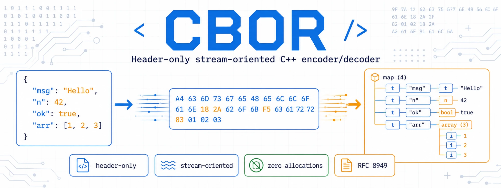

# cbor

A lightning-fast, header-only, stream-oriented [CBOR](https://cbor.io/) ([RFC 8949](https://www.rfc-editor.org/rfc/rfc8949.html)) encoder/decoder. The core classes never allocate memory.

## Encoding
Derive a class from `cbor_encoder` (defined in `cbor_encoder.h`) and override the `put_byte` method to write each byte wherever you like:

    virtual void put_byte(uint8_t b);

Then use the `cbor_encoder` methods (`write_bool()`, `write_int()`, `write_array()`, etc.) to encode your data. Integers are automatically written in the shortest form, as required by the RFC 8949 preferred serialization.

For floating-point values, use `write_float_shortest()`: it also follows the preferred serialization, picking the shortest of the half/single/double encodings that represents the value exactly. The output is interoperable with any standard-conforming CBOR decoder. Fixed-width helpers `write_double()` (64-bit), `write_float()` (32-bit) and `write_half_float()` (16-bit) are available when a specific width is required.

To write a byte string or a text string, first call `write_bytes_header()` or `write_string_header()` and then write the payload directly to your output. Note that CBOR text strings must be valid UTF-8; the encoder does not verify this.

A helper class `cbor_encoder_ostream` (from `cbor_encoder_ostream.h`) extends `cbor_encoder` to write to a standard `std::ostream`, adding the convenience methods `write_string()` and `write_bytes()`.

## Decoding
Derive a class from `cbor_decoder` (defined in `cbor_decoder.h`) and override the `get_byte` method to read one byte from your input:

    virtual uint8_t get_byte();

Then call `cbor_decoder::read()` to read the next record (a `cbor_object`); it throws `cbor_decoder_exception` on malformed input. A `cbor_object` provides type-checking methods (`is_bool()`, `is_string()`, `is_float()`, etc.) and value accessors (`as_bool()`, `as_int()`, `as_double()`, etc.). Value accessors throw `cbor_decoder_exception` if the record's actual type doesn't match, or if an integer doesn't fit `int64_t`. Any CBOR floating-point value (half, single or double precision) can be read with `as_double()`/`as_float()`.

The decoder does not validate that text strings are valid UTF-8, and it does not track nesting, so indefinite-length items and tags are reported as they are; walking them is up to the caller (see `is_indefinite_array()`, `is_break()`, `is_tag()`, etc.).

A helper class `cbor_decoder_istream` (from `cbor_decoder_istream.h`) extends `cbor_decoder` to read from a standard `std::istream`, adding the convenience methods `read_string()` and `read_bytes()`.

## Example

	{
		std::ofstream f("test.bin", std::fstream::binary);
		f.exceptions(std::fstream::failbit | std::fstream::badbit);
		cbor_encoder_ostream encoder(f);

		encoder.write_array(2);
		encoder.write_string("Hello, World!");
		encoder.write_int(42);
	}

	{
		std::ifstream f("test.bin", std::fstream::binary);
		f.exceptions(std::fstream::failbit | std::fstream::badbit);
		cbor_decoder_istream decoder(f);

		std::cout << "array size: " << decoder.read().as_array() << std::endl;
		std::cout << decoder.read_string() << std::endl;
		std::cout << decoder.read().as_int() << std::endl;
	}
